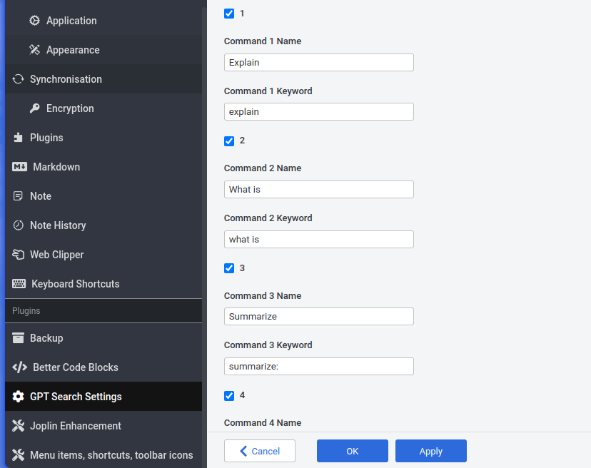
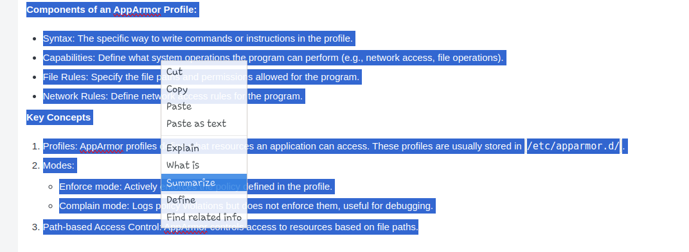
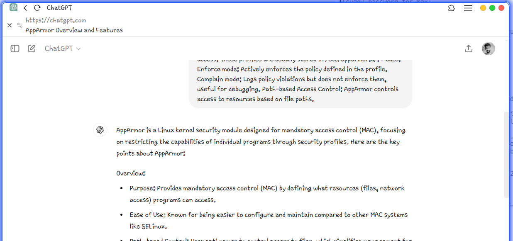

# Joplin GPT Search Plugin - [Get it on Joplin Plugin store](https://joplinapp.org/plugins/plugin/Jopline-Plugin-Chat-GPT-Search/)
Blog Post: [Go to Website](https://www.techfixerlab.com/2024/10/joplin-gpt-search-plugin-boost-your.html)
## Description

The Joplin GPT Search Plugin enhances your note-taking experience by integrating customizable GPT-powered search commands. This plugin allows users to configure up to five distinct search commands, each with adjustable visibility, label, and keyword settings.

## Features

* **Customizable Search Commands**:
  * **Visibility**: Toggle each search command on or off using a checkbox.
  * **Label**: Edit the display name for each command.
  * **Keyword**: Define the keyword that triggers the search.
* **Settings Section**:
  * `GPTSearchCommandX`: A boolean setting to enable or disable a specific search command.
  * `GPTSearchLabelX`: An editable label for the search command, which determines the name displayed in the context menu.
  * `GPTSearchKeywordX`: An editable keyword used for the search query.

## How It Works

1. **Configuration**:

   * Set up search commands by specifying the visibility, label, and keyword in the plugin settings.

     
2. **Execution**:

   * Access the context menu in the Joplin editor by right-clicking. Select a search command to perform a search using the selected text and configured keyword.
     
3. **Results**:

   * The search query is opened in an external browser, displaying results from ChatGPT.

     

## Usage

1. **Access Settings**:
   * Navigate to the plugin settings section to configure your search commands.
2. **Edit Labels and Keywords**:
   * Customize the label and keyword for each command as required.
3. **Toggle Visibility**:
   * Enable or disable commands according to your preferences.
4. **Perform Search**:
   * Use the context menu within Joplin's editor to execute searches with the configured commands.

The Joplin GPT Search Plugin offers a flexible solution for integrating GPT-powered searches directly into Joplin, tailored to fit your specific needs and preferences.

Reference for Starting development: [Getting started with plugin development](https://github.com/laurent22/joplin/blob/dev/readme/api/get_started/plugins.md)
