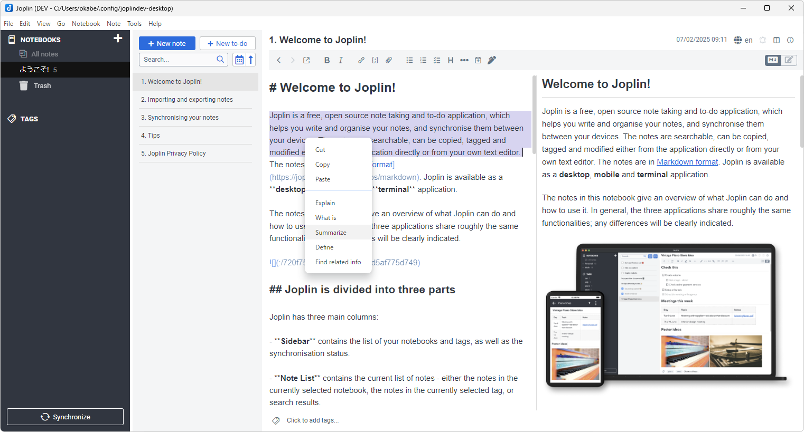

# AI-Chatbot-Assistant 

 

## Description

Integrating [Joplin](https://joplinapp.org/) with a self-hosted AI platform like [Open WebUI](https://openwebui.com/), the plugin **AI Chatbot Assistant** assists you with providing a powerful AI deployment platform to operate entirely offline. 

## How to use
* Go to `Tools` > `Options` > `AI Chatbot Assistant` Plugin Section.
* Enter `Base URL` and `Model`
* Restart Joplin to enable the plugin

 

## Customization
* `Base URL`: Enter your Open WebUI instance URL, or like https://chatgpt.com
* `Model`: Specify a model for the chat session, like gpt-4o
* `Additional Parameters`: In Open WebUI, chat sessions can be customized through various [URL parameters](https://docs.openwebui.com/features/chat-features/url-params/). 
  - `temporary-chat`: Mark the chat as a temporary session if set `true`. 
  - `web-search`: Enable web search functionality if set `true`. 

## How it works

Right-click on a selected text shows the context menu with Command Names as specified in the Plugin Setting Section. Chatbot's response to the query or prompt is displayed in an external browser. 

**This plugin is enhancement of [Joplin GPT Search Plugin](https://joplinapp.org/plugins/plugin/Jopline-Plugin-Chat-GPT-Search/) by Bhashkar Kumar Gupta.**
